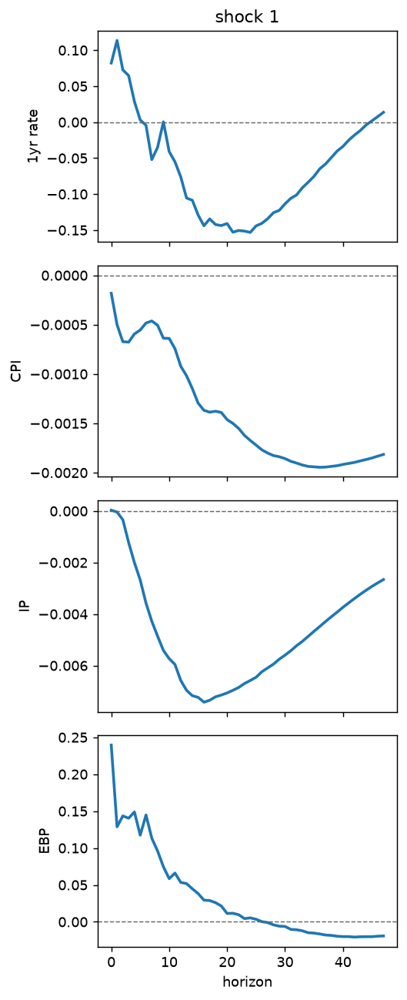

# pyvartoolbox

VAR and local-projection analysis in Python.

> ## Attribution
>
> **This is an unofficial Python replication of someone else's work.** The
> original is the MATLAB [VAR Toolbox](https://github.com/ambropo/VAR-Toolbox)
> (v4.0) by **Ambrogio Cesa-Bianchi**, who wrote the algorithms, the
> identification schemes, and the accompanying VAR Handbook. This repository
> reimplements that toolbox in Python; the econometrics and the design are his,
> the Python is mine.
>
> It is a derivative work under the GPL-3.0, which is the licence the original
> carries. It is **not affiliated with, maintained by, reviewed by, or endorsed
> by** Ambrogio Cesa-Bianchi. Any bug here is mine, not his.
>
> For the authoritative implementation, the handbook, and the replication
> exercises, use the upstream MATLAB toolbox. If you use this package in
> research, cite the original (see [Citing](#citing)).


## Why this exists

`statsmodels` covers reduced-form VARs and recursive SVARs well. It does not
cover the identification schemes most applied macro work now relies on: proxy
SVARs, narrative sign restrictions, or historical decompositions with proper
inference. The MATLAB VAR Toolbox does — and is the de-facto reference for
several of them — but only in MATLAB.

## Install

```bash
uv add "pyvartoolbox[plot]"        # add [jax] for the accelerated bootstrap
```

## Quickstart

```python
import pyvartoolbox as vt

m = vt.VARmodel(y, nlags=4)              # y is (nobs, nvar)
assert m.is_stable()
irf = m.irf(horizon=40, ident="chol")    # (41, nvar, nshock)
bands = vt.bootstrap_irf(m, horizon=40, nboot=1000, seed=0)
vt.plot_irf(bands.irf, bands.lower, bands.upper)
```

`irf[h, i, j]` is the response of variable `i` at horizon `h` to shock `j` — the
same ordering for `vd` and `hd`.

## What it does

| | |
| --- | --- |
| Estimation | OLS VAR(p), deterministic and exogenous terms, companion form, stability, Wold |
| Identification | Cholesky, long-run zero, proxy SVAR, sign, narrative sign, sign+IV |
| Dynamics | impulse responses, variance decompositions, historical decompositions |
| Local projections | OLS and IV, Newey–West, long-difference |
| Inference | residual and wild bootstrap, flat-prior posterior draws, identified sets |
| Performance | optional JAX backend for the bootstrap (~8× at `nboot=2000`) |
| Figures | matplotlib helpers, styling centralised in `config.yaml` |

## Documentation

Depth lives in [`skill/`](skill), which is written for both humans and agents.
It is the canonical documentation — this README is only an entry point.

| | |
| --- | --- |
| [Choosing an identification scheme](skill/references/identification.md) | assumptions, when each is defensible, how it fails |
| [Econometric background](skill/references/theory.md) | the identification problem, Wold, stability |
| [Concept graph](skill/graph/INDEX.md) | the same theory as linked atomic notes |
| [VAR Handbook, reformatted](skill/handbook/INDEX.md) | Cesa-Bianchi's handbook converted for machine reading |
| [What each band means](skill/references/inference.md) | bootstrap vs identified set vs posterior |
| [API reference](skill/references/api.md) | every public symbol and shape |
| [Conventions and gotchas](skill/references/conventions.md) | read this when a result looks wrong |
| [Worked recipes](skill/references/workflows.md) | copy-paste starting points |
| [Validation](skill/references/validation.md) | exactly what has been checked, and against what |

Project state is in [`STATUS.md`](STATUS.md); the ticket history is in
[`docs/roadmap.md`](docs/roadmap.md).

## Validation

Everything is checked against the **MATLAB VAR Toolbox 4.0 itself**, not merely
for internal consistency. Reference values are committed under `tests/fixtures/`
so CI reproduces the comparison without a MATLAB licence.

| Replication | Scheme | Agreement |
| --- | --- | --- |
| Stock and Watson (2001) | Cholesky | 1e-10 to 1e-12 |
| Blanchard and Quah (1989) | long-run zero | 1e-10 to 1e-12 |
| Gertler and Karadi (2015) | proxy SVAR | 1e-7 (conditioning floor) |
| Jordà and Taylor (2025) | local projections, OLS | 1e-9 |
| Jordà and Taylor (2025) | local projections, IV | 1e-8 incl. first-stage F |

Uhlig (2005) and Antolín-Díaz–Rubio-Ramírez (2018) are rejection samplers, so
draw-for-draw agreement is impossible and is not claimed; they are validated
through the rotations MATLAB accepted. Bootstrap and posterior draws are tested
through distributional properties. Full detail, including the deliberate
convention differences, in [validation.md](skill/references/validation.md) and
[docs/fixtures.md](docs/fixtures.md).

## Replicating the six upstream exercises

The datasets ship with the package, so every exercise runs from a clean install:

```bash
pyvartoolbox-replicate all --outdir figures
```

Committed output is in [`figures/`](figures). Gertler and Karadi (2015), proxy
SVAR — rate and excess bond premium up, CPI and industrial production down, and
no price puzzle:



Each exercise is importable too:
`from pyvartoolbox.replications import gertler_karadi_2015`.

## Figure styling

All appearance is centralised in
[`src/pyvartoolbox/config.yaml`](src/pyvartoolbox/config.yaml) — Latin Modern,
no top or right spine, restrained palette, integer horizon ticks.

```python
vt.use_style(overrides={"font": {"size": 12}})
vt.use_style("house_style.yaml")
```

Latin Modern usually ships with a TeX distribution rather than as a system font,
so the style module searches TeX Live and MiKTeX locations and falls back
through CMU Serif to matplotlib's bundled `cmr10`. `vt.style.active_font()`
reports what actually resolved.

## Design notes

- **numpy is the reference implementation.** JAX is optional and scoped to the
  bootstrap, where it buys ~8×. It was tried for the rotation sampler and
  removed — 300× *slower* there, since small QR decompositions are dominated by
  dispatch overhead.
- **Float64 throughout.** Companion recursions and long-run restrictions are
  ill-conditioned; the JAX backend forces `jax_enable_x64`.
- **`lstsq`, not normal equations.** VAR regressors are collinear by
  construction and squaring the condition number is avoidable — even though it
  means not matching upstream bit-for-bit on ill-conditioned designs.

## Licence

GPL-3.0-or-later, inherited from the upstream VAR Toolbox. If you need a
permissively licensed VAR implementation, use `statsmodels`.

## Citing

Cite the original toolbox and handbook, not this package:

> Cesa-Bianchi, A. *VAR Toolbox*. https://github.com/ambropo/VAR-Toolbox
