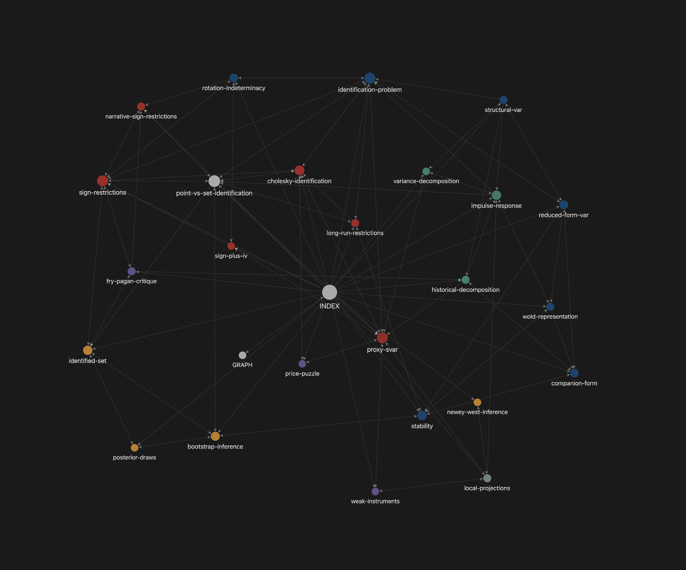

# Concept graph

25 concepts, 80 typed relations.

*Obsidian's Graph View, coloured by the `type` and `layer` frontmatter:
foundations blue, schemes red, reported objects green, inference amber,
pitfalls purple. A snapshot — open this folder as a vault for the
interactive version, where you can filter and follow links.*

The same structure follows as a Mermaid diagram. It is denser to read,
but it is generated from the notes by `pyvartoolbox-graph-diagram` on
every change and is plain text, so it cannot go stale and a model can
parse it. **Do not hand-edit** — regenerate. A hand-maintained map drifts
within a week, and a wrong map is worse than none.

Regenerating is maintainer tooling and needs a repo checkout: the command
ships with the `pyvartoolbox-docs` dev workspace package, not with the
installed library.

```mermaid
graph LR
  subgraph foundation["Foundations"]
    companion-form["Companion form"]
    identification-problem["The identification problem"]
    reduced-form-var["Reduced-form VAR"]
    rotation-indeterminacy["Rotation indeterminacy"]
    stability["Stability"]
    structural-var["Structural VAR"]
    wold-representation["Wold (moving-average) representation"]
  end
  subgraph objects["What gets reported"]
    historical-decomposition["Historical decomposition"]
    impulse-response["Impulse response function"]
    variance-decomposition["Forecast error variance decomposition"]
  end
  subgraph schemes["Identification schemes"]
    cholesky-identification["Cholesky (zero contemporaneous restrictions)"]
    long-run-restrictions["Long-run zero restrictions (Blanchard-Quah)"]
    narrative-sign-restrictions["Narrative sign restrictions (Antolín-Díaz & Rubio-Ramírez)"]
    proxy-svar["Proxy SVAR / external instruments"]
    sign-plus-iv["Sign restrictions combined with an instrument"]
    sign-restrictions["Sign restrictions (Uhlig)"]
  end
  subgraph inference["Inference"]
    bootstrap-inference["Bootstrap inference"]
    identified-set["The identified set"]
    newey-west-inference["Newey-West (HAC) inference"]
    posterior-draws["Posterior draws"]
  end
  subgraph pitfalls["Pitfalls"]
    fry-pagan-critique["The Fry-Pagan critique"]
    price-puzzle["The price puzzle"]
    weak-instruments["Weak instruments"]
  end
  subgraph other["Cross-cutting"]
    local-projections["Local projections (Jordà)"]
    point-vs-set-identification["Point versus set identification"]
  end
  bootstrap-inference -- "valid for" --> point-vs-set-identification
  bootstrap-inference -- "diagnostic" --> stability
  bootstrap-inference -- "distinct from" --> identified-set
  bootstrap-inference -- "distinct from" --> posterior-draws
  cholesky-identification -- "resolves" --> identification-problem
  cholesky-identification -- "symptom of failure" --> price-puzzle
  cholesky-identification -- "superseded in pra…" --> proxy-svar
  cholesky-identification -- "is" --> point-vs-set-identification
  companion-form -- "rewrites" --> reduced-form-var
  companion-form -- "determines" --> stability
  companion-form -- "drives" --> historical-decomposition
  fry-pagan-critique -- "applies to" --> sign-restrictions
  fry-pagan-critique -- "applies to" --> narrative-sign-restrictions
  fry-pagan-critique -- "qualifies" --> identified-set
  historical-decomposition -- "requires" --> companion-form
  historical-decomposition -- "answers" --> impulse-response
  identification-problem -- "caused by" --> reduced-form-var
  identification-problem -- "formalised by" --> rotation-indeterminacy
  identification-problem -- "resolved by" --> cholesky-identification
  identification-problem -- "resolved by" --> long-run-restrictions
  identification-problem -- "splits into" --> point-vs-set-identification
  identified-set -- "produced by" --> sign-restrictions
  identified-set -- "contrasts with" --> bootstrap-inference
  identified-set -- "caveat" --> fry-pagan-critique
  impulse-response -- "requires" --> wold-representation
  impulse-response -- "requires" --> identification-problem
  impulse-response -- "aggregates into" --> variance-decomposition
  impulse-response -- "band meaning depe…" --> point-vs-set-identification
  local-projections -- "alternative estim…" --> impulse-response
  local-projections -- "requires" --> newey-west-inference
  local-projections -- "IV variant shares…" --> proxy-svar
  long-run-restrictions -- "requires" --> stability
  long-run-restrictions -- "is" --> point-vs-set-identification
  long-run-restrictions -- "contrasts with" --> cholesky-identification
  narrative-sign-restrictions -- "extends" --> sign-restrictions
  narrative-sign-restrictions -- "is" --> point-vs-set-identification
  newey-west-inference -- "required by" --> local-projections
  point-vs-set-identification -- "governs" --> bootstrap-inference
  point-vs-set-identification -- "governs" --> identified-set
  point-vs-set-identification -- "source" --> identification-problem
  posterior-draws -- "combines with" --> identified-set
  posterior-draws -- "Bayesian counterp…" --> bootstrap-inference
  price-puzzle -- "symptom of" --> cholesky-identification
  price-puzzle -- "resolved by" --> proxy-svar
  proxy-svar -- "alternative to" --> cholesky-identification
  proxy-svar -- "fixes" --> price-puzzle
  proxy-svar -- "vulnerable to" --> weak-instruments
  proxy-svar -- "combines with sig…" --> sign-plus-iv
  reduced-form-var -- "produces" --> wold-representation
  reduced-form-var -- "produces" --> companion-form
  reduced-form-var -- "must satisfy" --> stability
  reduced-form-var -- "maps to" --> structural-var
  reduced-form-var -- "maps to" --> identification-problem
  rotation-indeterminacy -- "restates" --> identification-problem
  rotation-indeterminacy -- "exploited by" --> sign-restrictions
  rotation-indeterminacy -- "exploited by" --> narrative-sign-restrictions
  rotation-indeterminacy -- "constrained by" --> sign-plus-iv
  sign-plus-iv -- "composes" --> proxy-svar
  sign-plus-iv -- "composes" --> sign-restrictions
  sign-plus-iv -- "constrains" --> rotation-indeterminacy
  sign-restrictions -- "exploits" --> rotation-indeterminacy
  sign-restrictions -- "is" --> point-vs-set-identification
  sign-restrictions -- "summarised by" --> identified-set
  sign-restrictions -- "summarised by" --> fry-pagan-critique
  sign-restrictions -- "tightened by" --> narrative-sign-restrictions
  sign-restrictions -- "rebuts" --> cholesky-identification
  stability -- "property of" --> companion-form
  stability -- "precondition for" --> wold-representation
  stability -- "precondition for" --> long-run-restrictions
  stability -- "diagnostic for" --> bootstrap-inference
  structural-var -- "requires" --> reduced-form-var
  structural-var -- "determined by" --> identification-problem
  structural-var -- "yields" --> impulse-response
  variance-decomposition -- "derived from" --> impulse-response
  variance-decomposition -- "degenerate under" --> proxy-svar
  weak-instruments -- "threatens" --> proxy-svar
  weak-instruments -- "threatens" --> local-projections
  wold-representation -- "requires" --> stability
  wold-representation -- "equivalent to" --> companion-form
  wold-representation -- "combined with `B`…" --> impulse-response
  classDef foundation fill:#eef2f7,stroke:#1f4e79,color:#12263a;
  class companion-form,identification-problem,reduced-form-var,rotation-indeterminacy,stability,structural-var,wold-representation foundation;
  classDef objects fill:#eef5f1,stroke:#4c8c72,color:#12263a;
  class historical-decomposition,impulse-response,variance-decomposition objects;
  classDef schemes fill:#f7eeee,stroke:#a4342c,color:#12263a;
  class cholesky-identification,long-run-restrictions,narrative-sign-restrictions,proxy-svar,sign-plus-iv,sign-restrictions schemes;
  classDef inference fill:#f6f1e8,stroke:#c98b2e,color:#12263a;
  class bootstrap-inference,identified-set,newey-west-inference,posterior-draws inference;
  classDef pitfalls fill:#f2eef7,stroke:#6b5b95,color:#12263a;
  class fry-pagan-critique,price-puzzle,weak-instruments pitfalls;
  classDef other fill:#f2f2f2,stroke:#7f8c8d,color:#12263a;
  class local-projections,point-vs-set-identification other;
```

Node text links nowhere by design: Mermaid link support varies by
renderer, and a diagram that half-works is worse than one that clearly
does not. Use [INDEX.md](INDEX.md) to navigate.

## Other ways to view this

- **Obsidian** — point a vault at this folder. The notes are already
  wikilinked, so the native graph view works with no conversion, and it is
  interactive in a way a static diagram is not.
- **Any wikilink-aware editor** — Foam, Dendron, Logseq all read this
  layout directly.
